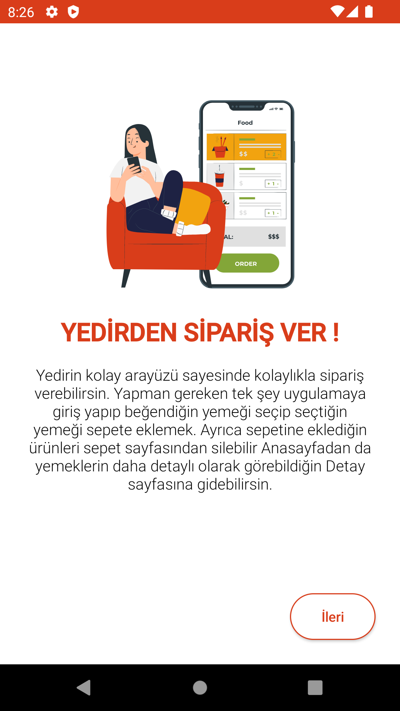
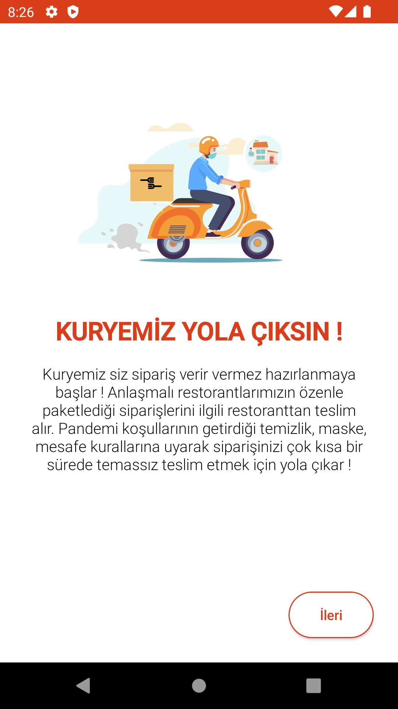
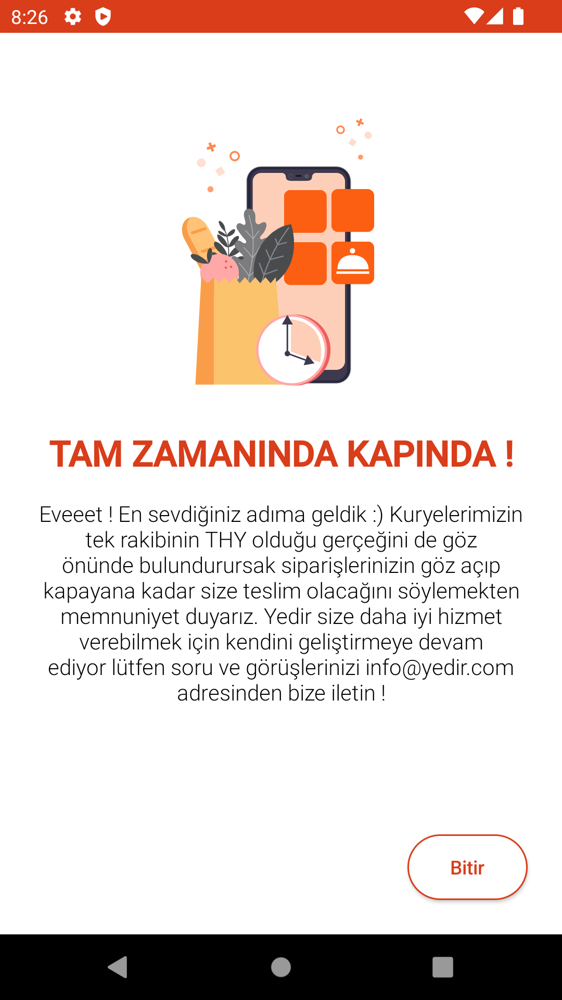
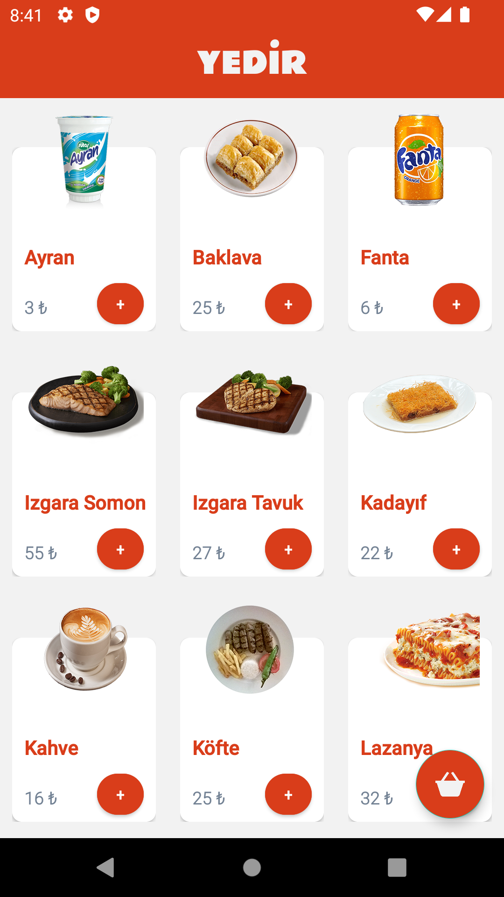
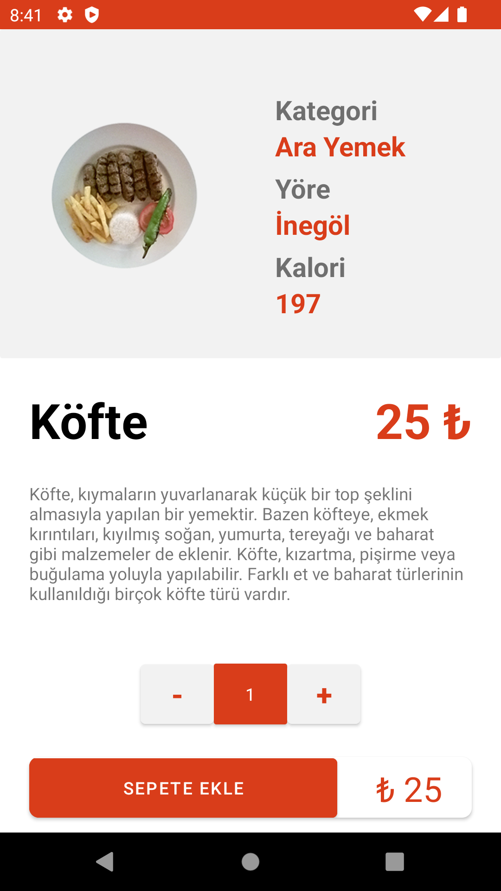
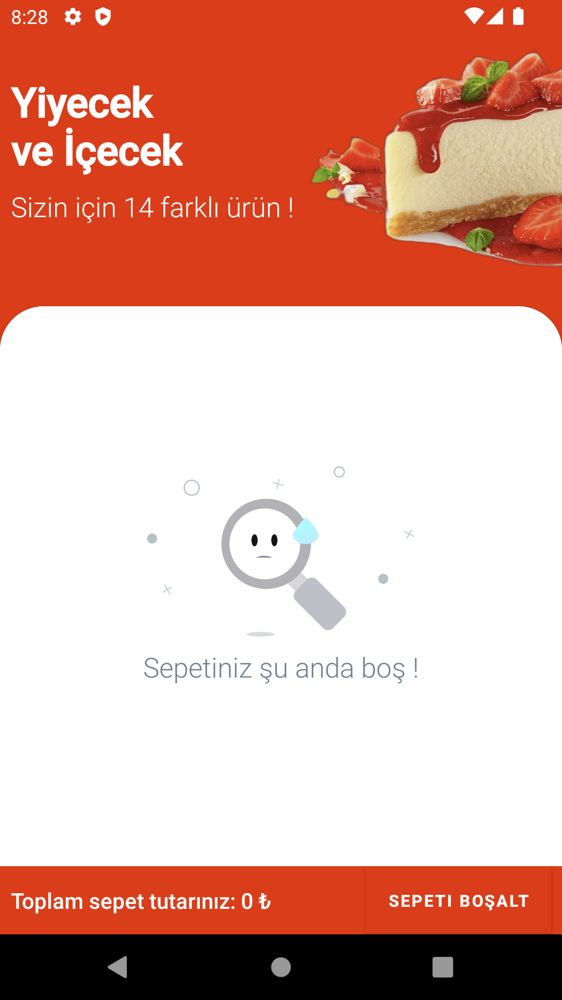
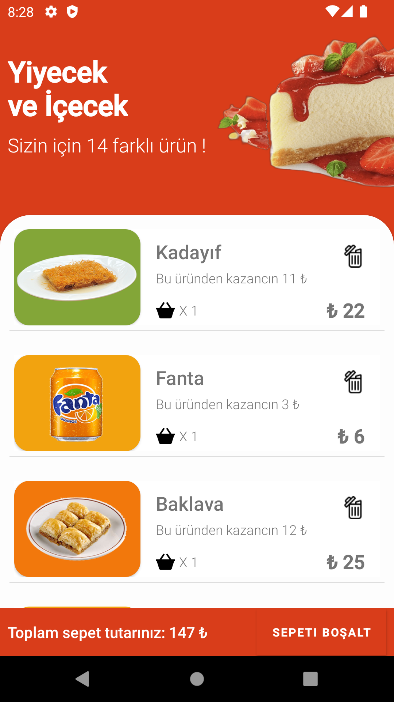

# YEDİR

### Devnot tarafında düzenlenen Android Bootcamp bitirme projesi

## Özet
### Kotlin, Firebase ve Web Servis kullanılarak yazılmış restoranta özel bir yemek sipariş uygulamasıdır.

## Kullanılan Teknolojiler
- Uygulama mimarisi
  * MVVM
- Detay sayfasına veri aktarımı
  * Firebase Real Time Database
- Api işlemleri ve Json Parse
  * Retrofit & Gson
- Onboarding-Splash-HomePage geçiş yönetimi  
  * DataStore
- Ekranlar arası veri transferi ve geçiş
  * Navigation Component
- Animasyonlar 
  * Lottie
- Uygulama tasarımları
  * Uplabs
- Uygulama ikon oluşturma
  * Romannurik
- Uygulama içi resim yükleme işlemleri
  * Picasso
  
## Uygulama Ekranları


<p float="left">



</p>

<p float="left">



</p>

<p float="left">


</p>

## Kurulum
### Kurulum için öncelikle Android Studio 2020 3.1 sürümünü kullanınız ardından aşağıdaki komut ile projeyi klonlayıp kullanmaya başlayabilirsiniz.

```
git clone https://github.com/mehmetsaltan1/DevNotKotlinBootcamp-Yedir
```


